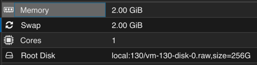

# Tverrfaglig Prosjekt 2 - Jarl Mathias

### Om prosjektet

<b>IP: http://172.20.128.64/src/main/resources/static/</b>

Programmet er et program hvor du kan logge inn som en bruker og har tilgang til din individuelle database. Originalt skulle det være et program hvor man kunne samle og bruke kort, 
men det var ikke tid til det. Istedenfor har man en tabell over alle kortene sine, og kan legge til på fri vilje.

Programmet blir kodet i HTML, JavaScript (med jQuery), PHP og CSS. Programmet er satt opp på en server hvor det også ligger en MariaDB database. Gjennom PHP snakker programmet med 
databasen, hvor brukerene og kortene blir lagret. Serveren bruker Apache2.

### Filene
Originalt skulle prosjektet bruker Java, og dette er grunnen til at programmet har alle ekstra filene (fra IntelliJ IDE), men jeg endte opp med å kke bruke Java siden det bare var 
tungvint for det jeg skulle lage. Alle frontend filene ligger i ``src/main/resources/static``, mens alle backend filene ligger i ``src/main/java/com/example/kortprogram``.

### Spesifikasjoner
Hvilke spesifikasjoner du burde ha på serveren din for å kjøre programmet.

* Du trenger å sette opp en server.
* Serveren trenger Apache2 installert.
* Serveren trenger MariaDB eller MySQL installert.
* Det er anbefalt å laste ned git.
* Husk å endre permissions og starting directory etter hvordan du vil ha det
  * Du kan endre DocumentRoot i /etc/apache2/sites-available/000-default.conf for å endre startside
* Sett opp en database og table på SQL serveren
* Endre PHP filene med brukernavn, passord, adresse, databasenavn og tablenavn etter hva du har satt det til

  
## Brukertesting
1. Flytt deg til ``registrer``-siden.
2. Får du laget en bruker?
3. Klarer du å logge inn med brukeren du akkurat lagde?
4. Hva vises på siden du da blir tatt til?
5. Prøv å legg til noe i tabellen.
  
6. Var programmet intuitivt å bruke?
7. Hva synes du om utseende/grafikken?
8. Er det noe som kunne forbedres?

## Kilder
HTML, PHP, CSS og SQL - https://www.w3schools.com/

GitHub in Ubuntu - https://www.howtoforge.com/tutorial/install-git-and-github-on-ubuntu/

Apache2 - https://ubuntu.com/tutorials/install-and-configure-apache#1-overview
